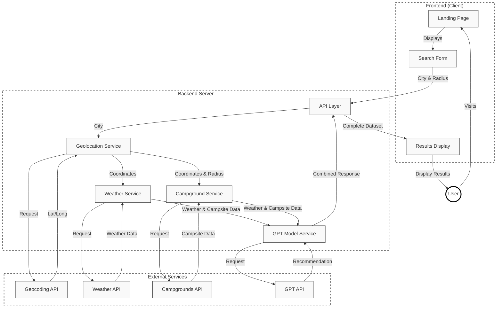

# SiteSighter 🏕️
 
SiteSighter is a web application designed to provide AI-driven camping recommendations based on weather, location, and other factors. It integrates with APIs like OpenAI for recommendations and external camping data sources to deliver a seamless experience for outdoor enthusiasts.

## **Key Features**

### **Frontend**
- **Interactive and Responsive UI**:
  - Built with **React** and styled using **Tailwind CSS** for a clean, user-friendly experience.
  - Dynamic loading messages and animations enhance user interaction.
- **Search Functionality**:
  - Users can input a city and select a radius to find nearby campsites.
  - Integrated city suggestions for seamless input.
- **AI-Driven Insights**:
  - Displays weather observations and top campsite recommendations powered by AI.

### **Backend**
- **API Endpoints**:
  - `/campsites`: Accepts location and radius to fetch campsites, weather details, and AI-generated recommendations.
- **AI Integration**:
  - Utilizes **OpenAI GPT** to generate observations and camping suggestions.
- **Data Aggregation**:
  - Combines real-time weather data and campsite information from public APIs.

---

## **How It Works**
1. **User Search**:
   - The user inputs a city and selects a search radius on the landing page.
2. **Data Fetching**:
   - The backend processes the request, gathers campsite and weather data, and uses AI to generate observations.
3. **Results Display**:
   - The frontend dynamically renders a list of campsites and AI-driven recommendations.

---

## **Technologies Used**

### **Frontend**
- **React**
- **JavaScript/TypeScript**
- **Tailwind CSS**
- **Vercel**

### **Backend**
- **Flask**
- **OpenAI GPT**
- **AWS EC2**
- **External APIs**:
  - Weather Information: [**OpenCage Geosearch API**](https://opencagedata.com/)
  - Campsite Information: [**Recreation.gov API**](https://ridb.recreation.gov/)

## Architecture Diagram

